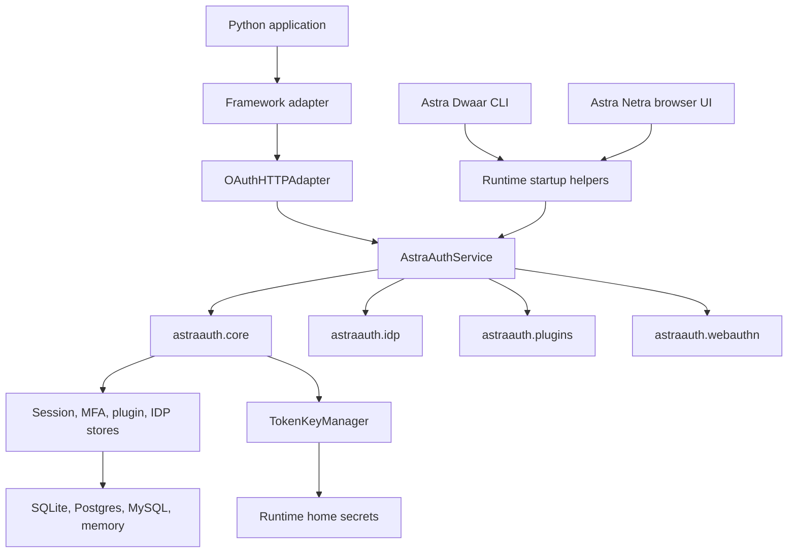
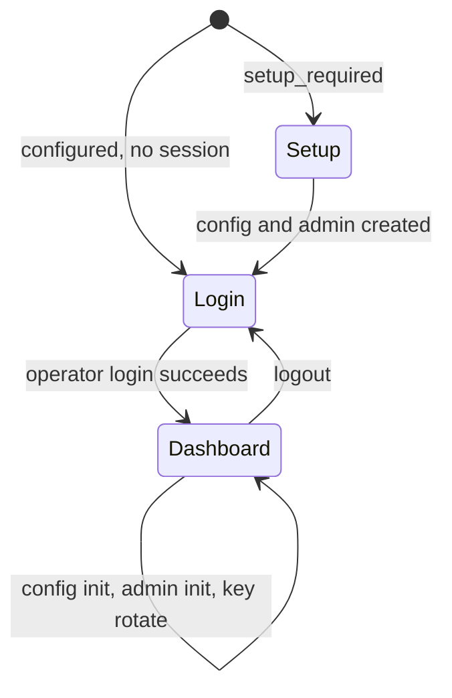
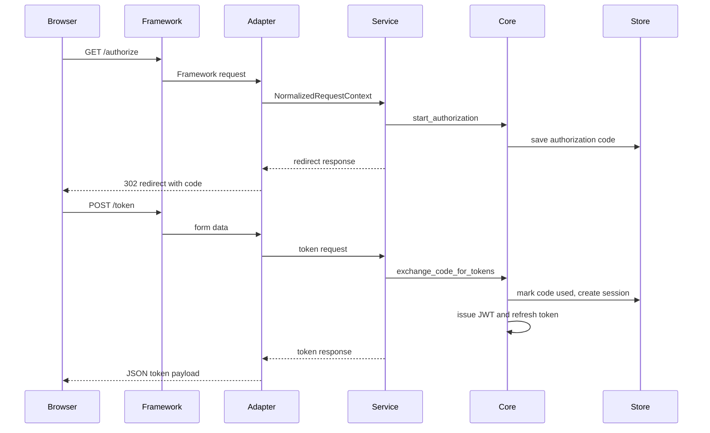

# Astra Architecture

Astra is a package-first authentication and authorization platform for Python applications. The repository is organized as a workspace of separately installable packages that share a common runtime model, but each package has a clear ownership boundary. The platform can be used as a library inside an application, mounted through framework adapters, operated through the CLI, or inspected through the browser admin UI.

This document describes the current architecture, runtime flows, security model, package boundaries, persistence strategy, operator tooling, documentation structure, and Version 1 release readiness.

## Architecture Goals

Astra is designed around these goals:

- Keep the core authentication and authorization model framework-neutral.
- Compose runtime services from explicit stores, registries, providers, and managers.
- Make framework adapters thin wiring layers over the same service and HTTP adapter contracts.
- Support package-by-package adoption instead of forcing one monolithic server.
- Keep operational workflows scriptable through the CLI and inspectable through the browser admin UI.
- Make secrets, token keys, setup artifacts, audit records, and throttling state explicit runtime-home assets.
- Prefer local, testable Python contracts over hidden external services.

| Public Name | Technical Package / Namespace | Description |
| --- | --- | --- |
| `Astra Yantra` | `astraauth` (`astraauth.core`) | Core platform domain models, persistence drivers, and auth protocols |
| `Astra Sutra` | `astraauth` (`astraauth.service`) | Runtime service execution engine, session validators, and setup helpers |
| `Astra Setu` | `astraauth` (`astraauth.adapters`) | Web framework adapters and HTTP middleware layers |
| `Astra Tantra` | `astraauth-plugins` (`astraauth_plugins` / `astraauth.plugins`) | Plugin hub and hook extension registry |
| `Astra Pramaan` | `astraauth` (`astraauth.idp`) | OIDC federation providers and discovery routing |
| `Astra Mudra` | `astraauth` (`astraauth.webauthn`) | WebAuthn verification contracts and authentication |
| `Astra Niyam` | `astraauth-policy` (`astraauth_policy`) | Zanzibar-style ReBAC schema parsing and permission solving |
| `Astra Mandal` | `astraauth-tenancy` (`astraauth_tenancy`) | Multi-tenancy isolation and dynamic routing |
| `Astra Dwaar` | `astraauth-cli` (`astraauth_cli`) | Operator CLI tool and Textual TUI panel |
| `Astra Netra` | `astraauth-admin-ui` (`astraauth_admin_ui`) | Operator Web Admin Console dashboard |

The root distribution `astraauth` contains the primary library code. Ancillary utilities compile against it as workspace members.

## Repository Layout

```text
Astra/
|-- docs/                         Published documentation source
|-- examples/                     Polished E2E framework sample applications and demos
|-- src/
|   `-- astraauth/                Consolidated package source
|       |-- core/                 Core domain and persistence layers
|       |-- service/              Observability and composition facade
|       |-- adapters/             Framework adapters (fastapi, django, etc.)
|       |-- idp/                  Enterprise OIDC federation
|       |-- webauthn/             WebAuthn ceremony verifiers
|       `-- plugins/              Core plugins engine and contracts
|-- packages/
|   |-- astraauth-cli/            Operator CLI (Astra Dwaar)
|   |-- astraauth-admin-ui/       Browser admin UI (Astra Netra)
|   |-- astraauth-plugins/        Plugins hub and built-in implementations (Astra Tantra)
|   |-- astraauth-policy/         ReBAC access policy engine (Astra Niyam)
|   `-- astraauth-tenancy/        Multi-tenancy isolation routing (Astra Mandal)
|-- tests/                        Consolidated tests suite
|-- zensical.toml                 Documentation site configuration
|-- pyproject.toml                Workspace root configuration
|`-- uv.lock                       Workspace dependency lock
```

## High-Level Runtime Model

Astra has a consolidated runtime model:

1. Core domain components and services (under `astraauth.core`, `astraauth.idp`, `astraauth.webauthn`, and `astraauth.plugins`) define protocols, storage models, and encryption parameters.
2. The service submodule (`astraauth.service`) composes these pieces into an `AstraAuthService` facade.
3. Framework adapters (`astraauth.adapters`) map framework-specific request/response objects to the core HTTP adapter contracts.
4. Operator tools (`astraauth-cli`, `astraauth-admin-ui`) load the core service facade.



## Core Package Architecture

`astraauth.core` owns the platform's framework-neutral domain model.

### Configuration

The configuration model is centered on `AuthConfig` and related settings models:

- `AuthConfig` defines project name, environment, issuer, token TTL, clock skew, signing and encryption algorithms, dev mode, persistence, IDP, and observability settings.
- `PersistenceConfig` maps logical stores to relational store configs.
- `RelationalStoreConfig` supports SQLite, Postgres, and MySQL DSNs for sync and async modes.
- Settings can be saved as encrypted JSON under the runtime home.
- Runtime settings key custody is tracked through metadata so diagnostics can report stale or missing keys.

Runtime config is file-backed by default. This makes local development, CI, package examples, and operator backup workflows deterministic.

### Persistence

The relational abstraction normalizes DSNs, infers dialects, compiles SQL placeholders, and creates sync or async database handles.

Supported persistence modes include:

- In-memory stores for tests, examples, and embedded use.
- SQLite for local runtime homes and package-first deployments.
- Postgres for production deployments that need external relational persistence.
- MySQL for production deployments that standardize on MySQL-compatible storage.
- Redis session store support for session-specific deployments.

The relational layer uses protocol-style cursor and connection interfaces so downstream stores can be written once and backed by different database drivers.

### OAuth, Sessions, and Tokens

Core OAuth responsibilities include client validation, authorization code flow with PKCE, refresh token rotation, password grants, API key grants, token exchange scaffolding, OIDC ID token claim building, and token validation.

`TokenKeyManager` is the central authority for token key material:

- Bootstraps signing and encryption RSA keys when no persisted key state exists.
- Issues signed JWT access and ID tokens.
- Issues and decrypts encrypted JWE payloads.
- Verifies JWT claims, issuer, audience, schema version, expiry, and not-before windows.
- Rotates signing or encryption keys independently.
- Exposes public JWKS.
- Dumps and restores private key state for runtime-home persistence and operator backup workflows.

Sessions are first-class records with subject, tenant, client, scopes, issue and expiry times, revoked state, version, ACR, AMR, and auth time. Session stores include in-memory, SQL, async SQL, and Redis-backed implementations.

### MFA and Authorization

MFA support includes TOTP factor enrollment and activation, email OTP code delivery and verification, MFA challenge creation, and session upgrade after verified challenge state. WebAuthn lives in `astraauth.webauthn`, but integrates with core MFA challenge and session upgrade contracts.

Authorization combines role assignment and policy evaluation:

- `Role` models named permission sets.
- Tenant-scoped role assignments connect subjects to roles per tenant.
- Authorization engine resolves roles and permissions.
- Policy rules can return allow, deny, or step-up outcomes.
- Scope policy maps permissions to OAuth scopes and can enforce strict scope filtering.

This provides a hybrid baseline: RBAC for common tenant authorization, policy rules for context-sensitive decisions, and `STEP_UP` for flows requiring stronger authentication.

### Security Utilities

Core security utilities include shared throttling, in-memory throttling, security header helpers, password hashing abstractions, API key digesting, and redaction-aware operator output. The shared throttle store is used by runtime and admin UI workflows so repeated failures and sensitive actions can be rate-limited across workers.

## Service Package Architecture

`astraauth.service` composes domain pieces into a deployable runtime.

### Service Facade

`AstraAuthService` includes:

- HTTP adapter.
- OAuth clients, subjects, authorization codes, sessions, roles, assignments, password authenticator, and API key authenticator.
- Token manager.
- Plugin runtime and hook runner.
- MFA challenge and factor stores.
- Email OTP delivery abstraction.
- WebAuthn handler and repositories.
- OIDC federation handler and repositories.
- Throttle store.

The service facade exposes convenience methods for adding clients, subjects, roles, plugin registrations, OIDC providers, and MFA enrollments.

### Runtime Composition

`build_service` builds an in-memory or persisted service from an `AuthConfig`. It selects stores based on configured persistence:

- In-memory backend for ephemeral/default use.
- SQL stores when configured for SQLite, Postgres, or MySQL.
- Plugin registry and throttle store based on persistence settings.
- WebAuthn repositories using the MFA persistence backend.
- IDP repositories using the IDP persistence backend.

`build_service_from_home` loads runtime config and token key state from the runtime home, builds the service, and applies the bootstrap manifest.

### Runtime Home

The runtime home is the operational state directory. By default it is `.astraauth` in the project root unless `ASTRAAUTH_HOME` or `--home` points elsewhere.

| Path | Purpose |
| --- | --- |
| `config.json` | Runtime configuration, encrypted by default. |
| `bootstrap.json` | Bootstrap admin records and setup tokens. |
| `secrets/settings.key` | Fernet key used to encrypt runtime config and state artifacts. |
| `secrets/settings-key-metadata.json` | Settings key custody metadata. |
| `secrets/token-keys.json` | Persisted private token key state, encrypted by default. |
| `logs/plugin-runtime-audit.jsonl` | Plugin hook and endpoint audit records. |
| `admin-actions.json` | Admin UI action audit trail, encrypted by runtime mapping. |
| `data/` | SQLite databases and shared throttle stores. |

### Bootstrap and Operator Functions

Bootstrap supports first-run operator setup:

- `initialize_config_home` writes config.
- `create_bootstrap_setup_token` creates short-lived setup tokens.
- `verify_bootstrap_setup_token` validates setup tokens.
- `write_initial_admin_setup` writes bootstrap admin records.
- `lock_bootstrap_setup` disables future setup-token issuance.
- `apply_bootstrap_manifest` loads bootstrap admins into the runtime service.

The service package also exports runtime config load, validate, reload, export, and import helpers; token key manager load, save, export, import, rotate, and JWKS export helpers; runtime health, inventory, persistence, security, diagnostics, and observability reports; backup artifact verification; and audit listing.

The operator API is intentionally Python-callable so CLI commands, admin UI endpoints, tests, and custom deployments can share the same behavior.

## HTTP Adapter and Framework Adapters

The core HTTP boundary uses framework-neutral request and response types:

- `NormalizedRequestContext` represents method, path, query params, headers, form data, cookies, client IP, and JSON body.
- `HttpResponse` represents status, body, and headers.
- `OAuthHTTPAdapter` routes normalized HTTP operations into token, authorize, introspection, logout, MFA, WebAuthn, and OIDC flows.

Framework adapters live in `astraauth.adapters` and map framework-specific primitives into the normalized contract.

Supported adapter products include ASGI, FastAPI, Flask, Django, Litestar, and Robyn.

Adapter responsibilities are intentionally narrow:

1. Read request input from the framework.
2. Build a `NormalizedRequestContext`.
3. Call the shared `OAuthHTTPAdapter`.
4. Convert `HttpResponse` back into the framework response type.
5. Apply common security headers and origin policy behavior where applicable.

This keeps protocol behavior centralized and prevents framework-specific drift.

## Plugin Architecture

`astraauth-plugins` provides extension points without making the core runtime dynamic or unsafe by default.

Key concepts include `Plugin`, `PluginManifest`, `PluginRuntime`, `PluginTrustPolicy`, `PluginAuditRecord`, and tenant plugin registry stores.

Plugin execution supports:

- Hook execution with fail-open or fail-closed behavior.
- Tenant-specific plugin enablement.
- Endpoint extensions with allowed table controls.
- Audit callbacks so service runtime can write plugin audit logs.

The service package wires plugin audit records to `logs/plugin-runtime-audit.jsonl` when an observability home is configured.

## OIDC Federation Architecture

`astraauth.idp` owns external identity provider federation.

Major components:

- `OIDCProviderConfig` describes external provider settings.
- Metadata discovery validates issuer metadata and endpoints.
- Login state records carry state, nonce, PKCE verifier, redirect URI, tenant, and expiry.
- Callback completion exchanges code, validates ID token, fetches userinfo, and returns an external profile.
- Identity link repository maps external identity to local subject ID.
- Group-role mappings convert external groups into local roles.
- Claim-attribute mappings transform external claims into subject attributes.
- Federation audit repository records success and failure outcomes.

The service package wraps this in `ServiceOIDCHandler`, which synchronizes subjects, resolves local roles, issues local Astra tokens, and writes audit records.

## WebAuthn Architecture

`astraauth.webauthn` owns passkey/WebAuthn ceremony state and verification contracts.

Major pieces:

- `WebAuthnCredential` stores credential ID, subject, tenant, public key, transports, sign count, and creation time.
- `WebAuthnRegistrationState` stores registration challenge state.
- `WebAuthnAuthenticationState` stores authentication challenge state linked to MFA challenges.
- In-memory, SQL, and async SQL repositories cover credential and state persistence.
- `LocalDevelopmentWebAuthnVerifier` supports explicit unsafe local development behavior only.
- `ProductionBaselineWebAuthnVerifier` enforces basic non-empty material and sign-count advancement.
- `PyWebAuthnVerifier` integrates with the optional `webauthn` library and requires full ceremony responses.
- `build_default_webauthn_verifier` prefers the optional library and falls back to the production baseline.

WebAuthn integrates with MFA as a step-up factor. A verified WebAuthn authentication can upgrade session ACR and AMR through the core MFA/session services.

## ReBAC Policy Architecture

`astraauth_policy` (Astra Niyam) implements a Zanzibar-style relationship-based access control (ReBAC) system:

- **Schema Parser** (`parser.py`) compiles KeyNetra-style entity relationship and permission definitions from a structured DSL.
- **Check Solver Engine** (`engine.py`) recursively processes permission and relationship checks. It includes circular loop detection via visited paths tracing and depth limit constraints.
- **Relation Tuple Store** (`store.py`) structures direct relationship tuples matching the `(subject, relation, object)` assertion form.

## Multi-Tenancy Architecture

`astraauth_tenancy` (Astra Mandal) handles operator workspace boundaries and dynamic request context binding:

- **Tenant Workspace** (`models.py`) defines tenant schemas, database connection parameters, and maximum entity counts.
- **Context Routing** (`middleware.py`) persists bound tenant contexts inside async/thread-safe `contextvars`.
- **Middleware integration** maps incoming request headers (e.g. `X-Tenant-ID`) to the context wrapper via ASGI middleware and Flask hooks.

## CLI Architecture

`astraauth.cli` exposes operator flows through Typer. The installed console script is `astra`.

Command groups include:

- Setup and config: `config-home`, `config-init`, `validate-config`, `config-export`, `config-import`, `config-key-rotate`.
- Runtime inspection: `health`, `doctor`, `observability`, `security`, `persistence-info`, `schema-ensure`, `runtime-inventory`.
- Backup and recovery: `state-export`, `state-import`, `backup-verify`.
- Key management: `key-jwks`, `key-export`, `key-import`, `key-rotate`.
- Bootstrap and setup: `init-admin`, `bootstrap-token-create`, `bootstrap-token-purge`, `bootstrap-lockdown`, `bootstrap-show`, `bootstrap-export`, `bootstrap-import`.
- Audits: `oidc-audit`, `admin-audit`, `plugin-audit`.
- Interactive flows: `wizard`, `admin-ui`.

The CLI does not own separate business logic. It delegates to service startup/operator helpers and uses display helpers for redacted JSON and readable terminal output.

There are two CLI interactive modes:

- `astra wizard`: setup-focused flow for config initialization, security inspection, admin creation, and key rotation.
- `astra admin-ui`: by default, serves the browser-based admin UI console (Astra Netra). Alternatively, run with `--tui` to launch the terminal-based admin dashboard.

## Browser Admin UI Architecture

`astraauth-admin-ui` provides Astra Netra, a browser-based admin dashboard.

Run it with:

```bash
uv run astra admin-ui --home .astraauth --port 8088
```

Then open:

```text
http://127.0.0.1:8088/
```

The UI stack uses FastAPI routes, Jinja templates, local static assets, htmx partial updates, encrypted cookie session state, CSRF tokens, shared throttling, no-store caching, and security headers.

### Browser Routes

| Route | Purpose |
| --- | --- |
| `GET /` | Main shell. Loads sidebar and main region through htmx. |
| `GET /partials/sidebar` | Sidebar after authentication. |
| `GET /partials/main` | Chooses setup, login, or dashboard view based on runtime state. |
| `POST /partials/session/login` | Authenticates operator admin. |
| `POST /partials/session/logout` | Clears session and redirects to `/`. |
| `GET /partials/dashboard/summary` | Summary cards. |
| `GET /partials/dashboard/runtime` | Runtime health and inventory panel. |
| `GET /partials/dashboard/infrastructure` | Persistence, JWKS, security, plugin audit, and throttle panel. |
| `GET /partials/dashboard/oidc-audit` | OIDC federation audit panel. |
| `GET /partials/dashboard/admin-audit` | Admin action audit panel. |
| `POST /partials/actions/config-init` | Initializes runtime config. |
| `POST /partials/actions/init-admin` | Creates bootstrap admin. |
| `POST /partials/actions/key-rotate` | Rotates signing or encryption runtime keys. |

JSON API routes mirror the same operations for programmatic use:

| Route | Purpose |
| --- | --- |
| `GET /api/session` | Current setup/session status. |
| `POST /api/session/login` | JSON login. |
| `POST /api/session/logout` | JSON logout. |
| `GET /api/dashboard` | Dashboard payload. |
| `GET /api/observability` | Observability report. |
| `GET /api/security` | Security report. |
| `GET /api/oidc-audit` | OIDC audit records. |
| `GET /api/admin-audit` | Admin action records. |
| `GET /api/plugin-audit` | Plugin runtime audit records. |
| `POST /api/actions/config-init` | JSON config initialization. |
| `POST /api/actions/init-admin` | JSON bootstrap admin creation. |
| `POST /api/actions/key-rotate` | JSON runtime key rotation. |

### UI State Flow

The UI starts in one of three states:

1. Setup mode: no usable bootstrap admin exists. The UI asks for a bootstrap setup token, config values, and first admin details.
2. Login mode: config and admin records exist, but the browser session is not authenticated.
3. Dashboard mode: an authenticated operator session exists.



### Admin UI Security Controls

The browser UI enforces:

- CSRF tokens for HTML form actions and JSON mutation routes.
- Encrypted session cookies using the runtime settings key.
- HttpOnly cookies with strict SameSite policy.
- Secure cookies when served over HTTPS.
- Login throttling by client, tenant, and username.
- Sensitive action throttling by client, actor, and action.
- Admin action audit logging for login, logout, config initialization, admin creation, key rotation, failures, and throttling.
- Security headers including CSP, frame denial, no-sniff, referrer policy, permissions policy, cross-origin opener policy, and no-store caching on dynamic responses.

## End-to-End Request Flows

### Authorization Code Flow



### Password, API Key, and MFA Step-Up Flow

1. The HTTP adapter receives `/token` form data.
2. The OAuth service validates the client and requested scopes.
3. Password or API key authenticator resolves the subject.
4. Authorization resolves roles and permissions.
5. Scope policy filters or rejects scopes.
6. A session is issued.
7. Access token, ID token when applicable, and refresh token are returned.
8. If required ACR is not satisfied, an MFA challenge response can be returned instead.
9. TOTP, email OTP, or WebAuthn verification upgrades the session ACR and AMR.
10. Token service issues tokens containing updated `acr` and `amr` claims.

### OIDC Federation Flow

1. Client starts OIDC login for a configured provider and tenant.
2. IDP package discovers metadata, creates state, nonce, and PKCE verifier.
3. User is redirected to the external provider authorization endpoint.
4. Callback validates state and exchanges code.
5. ID token is validated and userinfo is fetched.
6. External identity is linked or resolved to a local subject.
7. Group and claim mappings produce local roles and subject attributes.
8. Service issues local Astra tokens.
9. Federation audit is recorded.

### Plugin Hook Flow

1. Service calls hook runner with hook name, tenant ID, and payload.
2. Plugin runtime finds registered and tenant-enabled plugins.
3. Trust policy validates manifest constraints where configured.
4. Runtime executes plugins in controlled hook flow.
5. Fail-open or fail-closed behavior determines outcome on plugin failure.
6. Runtime emits audit records through the configured audit callback.
7. Service continues with adjusted payload or fails closed.

## Data and State Ownership

| State | Owner package | Store type |
| --- | --- | --- |
| Runtime config | `astraauth.core` and `astraauth.service` | Runtime-home JSON, encrypted by default |
| Token keys | `astraauth.core` and `astraauth.service` | Runtime-home JSON, encrypted by default |
| Sessions | `astraauth.core` | In-memory, SQL, async SQL, Redis |
| Authorization codes | `astraauth.core` | In-memory baseline |
| OAuth clients and subjects | `astraauth.core` and `astraauth.service` | In-memory baseline, service composition |
| MFA challenges and factors | `astraauth.core` | In-memory, SQL |
| WebAuthn credentials and states | `astraauth.webauthn` | In-memory, SQL, async SQL |
| OIDC login states, links, mappings, audits | `astraauth.idp` | In-memory, SQL |
| Tenant plugin registry | `astraauth.plugins` | In-memory, SQL |
| Plugin audit | `astraauth.service` | JSONL under runtime home |
| Admin UI audit | `astraauth.service` and `astraauth-admin-ui` | Encrypted runtime-home JSON |
| Throttle buckets | `astraauth.core` | In-memory or shared SQLite/relational store |

## Security Architecture

Astra's current security architecture has several layers.

### Token Security

- JWTs are signed with managed RSA signing keys.
- JWE support is available for encrypted payloads.
- Active signing and encryption keys are tracked independently.
- Token schema version is validated.
- Issuer, audience, expiration, not-before, and clock skew are validated.
- Public JWKS exposes non-private key material.
- Private key state is persisted encrypted by default.

### Runtime Secret Custody

- Runtime config and key exports use the settings key.
- Settings key metadata tracks key ID, creation time, active state, and rotation time.
- Diagnostics report missing, stale, or weak-permission settings key state.
- Config import re-encrypts by default.
- Runtime state export encrypts bootstrap content by default.
- Recipient public/private key workflows support portable encrypted backup handoff.

### Passwords, API Keys, and Admin Safety

- Password verification is abstracted behind verifier protocols.
- API keys are digested before storage.
- CLI and display helpers redact sensitive values from JSON output.
- Browser admin UI uses encrypted cookies and CSRF protection.
- Dynamic admin UI responses are no-store.
- Sensitive actions are throttled.
- Login failures are throttled.
- Admin actions are audited.
- Bootstrap setup tokens are short-lived and can be purged or locked down.

### Plugin Safety

- Plugin manifests and trust policy provide a controlled extension boundary.
- Endpoint extension access can be constrained to allowed tables.
- Hook execution supports fail-closed behavior.
- Plugin audit records include tenant, plugin name, execution type, target, status, failure classification, and duration.

## Observability and Diagnostics

Astra exposes operational diagnostics through service helpers, CLI commands, and admin UI panels:

- Runtime health reports service composition, environment, issuer, persistence backends, provider counts, and plugin counts.
- Runtime inventory reports OIDC providers, registered plugins, tenant plugin enablement, and bootstrap admin count.
- Persistence reports logical stores, backend, mode, and DSN.
- Runtime diagnostics report config validity, key custody, token-key validity, bootstrap validity, admin audit existence, and warnings/issues.
- Runtime observability reports structured logging and metrics settings plus counters.
- Runtime security report includes throttle state and plugin audit state.

CLI commands such as `astra health`, `astra doctor`, `astra observability`, `astra security`, and `astra persistence-info` expose the same data from scripts.

## Documentation Architecture

Published docs are configured through `zensical.toml`.

Current top-level sections are:

- Home
- Getting Started
- User Guide
- Examples
- Platform
- API Reference
- About

The docs source includes:

- User-facing guides under `docs/getting-started` and `docs/user-guide`.
- Example documentation under `docs/examples`.
- Platform status and package information under `docs/about`.
- Generated or API-focused pages under `docs/api`.

For Version 1, docs should make these distinctions clear:

- Product concepts belong in User Guide.
- Runtime operations belong in Platform or a dedicated Operations section.
- API pages should stay technical and package-oriented.
- Package READMEs should stay short and point to canonical docs.
- Examples should map one-to-one to supported products and runnable example files.
- Browser admin UI and terminal admin UI must be documented as different tools.

## Current Quality Gates

The following checks represent the current local quality gates:

```bash
uv run ty check --error-on-warning --output-format concise
.venv\Scripts\python.exe -m ruff check .
.venv\Scripts\python.exe -m pytest packages -o "addopts=-q --strict-markers --tb=short -p no:cacheprovider"
.venv\Scripts\zensical.exe build --strict
```

The project should not be released unless these pass from a clean checkout after dependency sync.

## Version 1 Readiness Assessment

### Code Correctness Status

The code is in strong shape for a pre-1.0 release candidate when the full local gates pass:

- Type checking passes with warnings treated as failures.
- Ruff linting passes.
- Package tests pass.
- Strict docs build passes.
- Key runtime flows are covered by tests: config, bootstrap, token keys, service composition, adapters, MFA, OIDC federation, plugins, WebAuthn, CLI, examples, and admin UI.

### Documentation Correctness Status

Docs are structurally buildable and navigable through `zensical.toml`. The documentation covers installation, quick start, configuration, authentication, authorization, MFA, OIDC, plugins, abuse controls, examples, package summaries, status, API reference, CLI, and admin UI.

For Version 1, docs still need a final editorial pass focused on:

- Removing or clearly labeling old phase/RFC language from user-facing pages.
- Ensuring every command documented in package READMEs has a canonical page in published docs.
- Ensuring examples docs cover all currently supported products: FastAPI, Flask, Django, Litestar, Robyn, ASGI, CLI, admin UI, plugins, OIDC, MFA, WebAuthn, and backup/export flows.
- Ensuring the browser admin UI and terminal admin UI distinction is clear everywhere.
- Ensuring status pages do not promise future packages as current shipped features.

### Version 1 Release Decision

Current recommendation: Astra is close to a Version 1 release candidate, but should not be tagged as Version 1 until the final release checklist is completed from a clean working tree.

Blocking items before a true Version 1 tag:

1. Clean working tree review: confirm every modified, deleted, and untracked file is intentional.
2. Package metadata audit: confirm names, versions, descriptions, extras, dependencies, classifiers, URLs, and README rendering for every workspace package.
3. Public API freeze: decide which modules, classes, functions, commands, route contracts, and config fields are stable for 1.x.
4. Documentation editorial pass: make docs coherent for users who did not see the implementation plan or phase history.
5. Example pass: run and document all supported examples, including Django, Litestar, Robyn, admin UI, encrypted backup, plugin trust policy, and WebAuthn production verifier.
6. Security release pass: verify setup-token behavior, admin UI CSRF/session behavior, key export/import behavior, password hashing migration posture, throttling, audit redaction, and backup encryption wording.
7. Distribution dry run: build all wheels/sdists, run `twine check`, install into a fresh virtualenv, and smoke-test CLI imports and core examples.
8. Publishing setup: configure and verify PyPI/TestPyPI trusted publishing or release credentials.
9. Versioning decision: update all package versions consistently and ensure changelog/release notes match the final artifact.

If those items are completed and the gates above pass in a clean environment, the project can be treated as ready for a Version 1 release.

## Recommended Version 1 Release Checklist

- [ ] Confirm git status contains only intentional release changes.
- [ ] Confirm deleted files are intentional.
- [ ] Normalize line endings if needed.
- [ ] Run `uv sync --all-groups` in a clean checkout.
- [ ] Run `uv run ty check --error-on-warning --output-format concise`.
- [ ] Run `uv run ruff check .`.
- [ ] Run full package tests.
- [ ] Run strict docs build.
- [ ] Build all packages.
- [ ] Run `twine check` on produced artifacts.
- [ ] Install the built artifacts into a fresh virtual environment.
- [ ] Run CLI smoke tests from installed artifacts.
- [ ] Run representative examples from installed artifacts.
- [ ] Review published docs navigation and search.
- [ ] Confirm PyPI project pages render expected README content.
- [ ] Tag the release only after artifacts and docs are confirmed.

## Summary

Astra's architecture is modular, layered, and coherent: the core domain logic is framework-neutral, service composition centralizes runtime behavior, and web adapters remain extremely thin. Operational workflows are managed through the CLI (Astra Dwaar) and the web admin UI (Astra Netra), which interface with the same runtime-home state.

To guarantee release safety, the **Quality Gates** and the **Recommended Version 1 Release Checklist** are essential safeguards. They verify that linting, type-checking, E2E framework examples, and strict documentation builds pass successfully from a clean checkout prior to any distribution tag. Version 1 should be treated as a release candidate milestone until the final packaging and dry-runs are executed.
