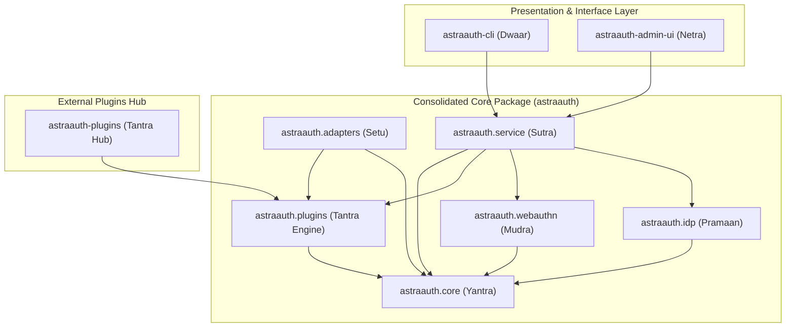
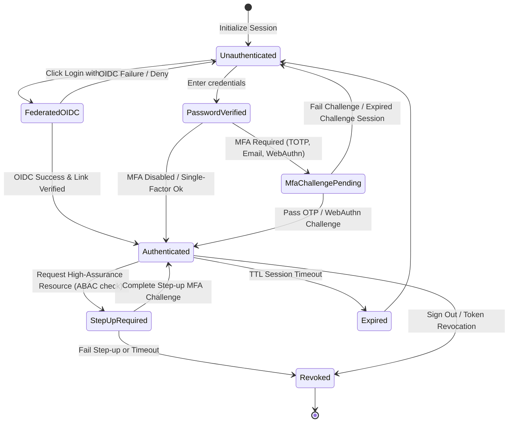
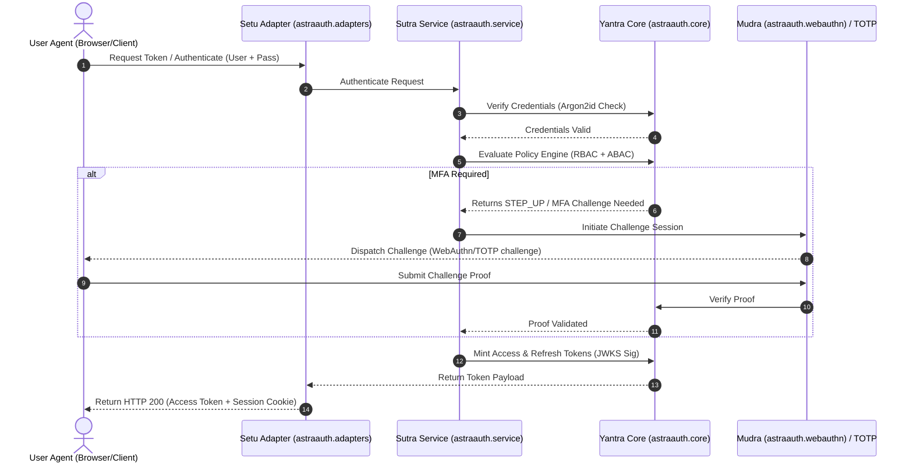
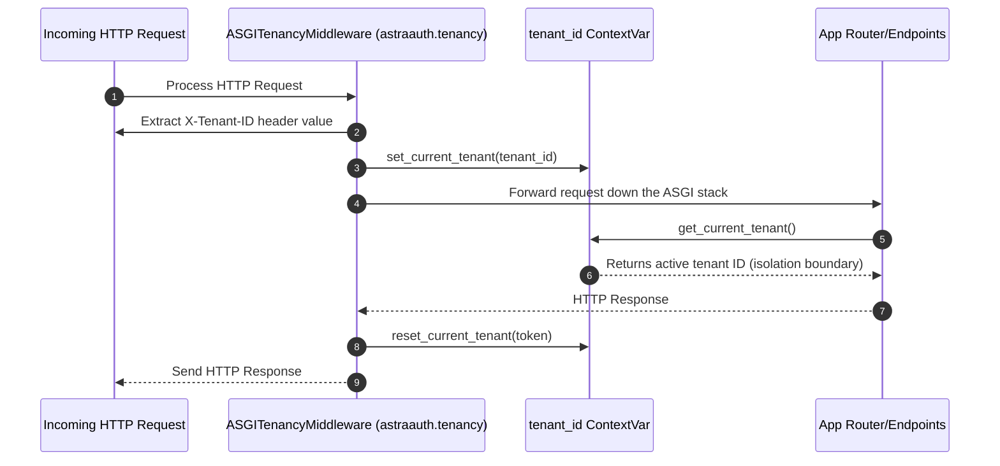

# AstraAuth System Context, Architecture & Workflow Reference

This reference document outlines the implementation, context, state machine, and sequential workflows of the AstraAuth platform.

---

## 1. System Context Diagram

The System Context diagram illustrates the system boundaries of the AstraAuth platform and how it interacts with external entities (operators, databases, clients, and identity providers).

```mermaid
graph TB
    subgraph Clients["External Client Applications & Services"]
        fastapi["FastAPI App (Setu Adapter)"]
        flask["Flask App (Setu Adapter)"]
        django["Django App (Setu Adapter)"]
        cli["Astra CLI / Textual TUI (Dwaar)"]
    end

    subgraph Platform["AstraAuth Platform Boundary"]
        adapters["astraauth.adapters (Setu)"]
        admin_ui["astraauth-admin-ui (Netra)"]
        core_service["astraauth.service (Sutra)"]
        core_domain["astraauth.core (Yantra)"]
        plugins["astraauth.plugins (Tantra Engine)"]
        idp["astraauth.idp (Pramaan)"]
        webauthn["astraauth.webauthn (Mudra)"]
    end

    subgraph RelationalDB["Relational Databases"]
        sqlite[("SQLite DB (Local/Dev)")]
        postgres[("PostgreSQL DB (Prod)")]
        mysql[("MySQL DB (Prod)")]
    end

    subgraph EventPubSub["Event Bus"]
        redis[("Redis Pub/Sub")]
        zmq[("ZeroMQ Broker")]
        inmem["InMemory Queue"]
    end

    subgraph ExternalProviders["External Identity Providers"]
        oidc["OIDC IdP (Google, Okta, Microsoft)"]
    end

    %% Client Interactions
    fastapi --> adapters
    flask --> adapters
    django --> adapters
    cli --> core_service
    
    %% Platform Internal Routing
    adapters --> core_domain
    admin_ui --> core_service
    core_service --> core_domain
    core_service --> idp
    core_service --> webauthn
    core_service --> plugins

    %% Data Store Relationships
    core_domain --> sqlite
    core_domain --> postgres
    core_domain --> mysql

    %% Event Broker Relationships
    core_domain --> redis
    core_domain --> zmq
    core_domain --> inmem

    %% Identity Provider Relationships
    idp --> oidc
```



---

## 2. Monorepo Layered Architecture

AstraAuth is designed around a layered structure with strict dependency flows. Downward layers are completely framework-agnostic.



### Module Descriptions
1.  **Astra Yantra (`astraauth.core`)**: The absolute foundation. Contains domain database models, configuration schemas, cryptography hashing defaults (Argon2id), session tokens/JWKS signatures, constant-time API validations, and hybrid RBAC+ABAC engine logic.
2.  **Astra Sutra (`astraauth.service`)**: Integrates and boots the database pool, configured logger redaction, event queues, and telemetry correlation ID hooks.
3.  **Astra Setu (`astraauth.adapters`)**: Adapts generalized platform session/token controls into FastAPI dependencies, Django middleware, Flask hooks, and Starlette ASGI frameworks.
4.  **Astra Mudra / Pramaan / Tantra**: Specialized features mapping to WebAuthn ceremonies, Federated OIDC endpoints, and plugin hook sandboxes respectively.

---

## 3. Session & Authentication State Machine

The following diagram tracks the lifecycle state of a user session through MFA challenge requirements, step-up rules, and token revoking.



---

## 4. Workflows

### A. Authentication & Step-Up Workflow

The workflow details an interactive flow where a client requests a resource, prompting the core to verify qualifications, trigger OTP challenges, and authorize the session.



### B. Tenant Plugin Hook Sandbox Workflow

Astra allows custom third-party behavior per tenant. To preserve execution integrity, hooks run within isolated sandbox parameters.

```mermaid
sequenceDiagram
    autonumber
    participant Adapter as Adapters (astraauth.adapters)
    participant Tantra as Plugins Runtime (astraauth.plugins)
    participant Sandbox as Plugin Sandbox (Isolated Context)
    participant EventBus as Event Bus

    Adapter->>Tantra: Trigger Hook (e.g. "auth.pre_authenticate")
    Tantra->>Tantra: Verify Trust Policy & Load Hook Config
    Tantra->>Sandbox: Execute Plugin Action Async
    
    alt Execution succeeds under Timeout Limit (e.g. 500ms)
        Sandbox-->>Tantra: Return Modified Payload / Success
        Tantra->>EventBus: Publish Audit log event
        Tantra-->>Adapter: Allow Auth Flow to continue
    else Execution Times Out or Throws Error
        Sandbox-->>Tantra: Timeout / Exception Boundary
        Tantra->>EventBus: Publish Critical Audit log event
        alt fail_closed is True (Strict Policy)
            Tantra-->>Adapter: Block Flow (Raise PluginExecutionError)
        else fail_closed is False (Lenient Policy)
            Tantra-->>Adapter: Continue flow (Log & bypass error)
        end
    end

---

## 5. ReBAC Permission Evaluation Workflow

This diagram outlines how `CheckEngine` evaluates permissions transitively by walking relationships and permissions in the Zanzibar schema:

```mermaid
sequenceDiagram
    autonumber
    participant App as Client Application
    participant Engine as CheckEngine (astraauth.policy)
    participant Store as RelationTupleStore
    participant Parser as SchemaParser

    App->>Engine: check(tenant_id, subject, relation_or_permission, object)
    Engine->>Parser: Look up entity definition in Schema
    Parser-->>Engine: Return relations & permissions definitions

    alt Is direct relation assertion
        Engine->>Store: Check direct matching tuple
        Store-->>Engine: Returns tuple matching (subject, relation, object)
    else Is permission evaluation
        Engine->>Engine: Traverse permission sub-expressions (union/intersection/exclusion)
        opt Recursive search
            Engine->>Engine: Walk parent relationships (avoiding circular loops)
        end
    end

    Engine-->>App: Returns boolean (ALLOWED/DENIED)
```

## 6. Multi-Tenancy Context Isolation Workflow

Shows the header-intercept lifecycle in `ASGITenancyMiddleware` to set dynamic contexts:


