# Package-by-Package Context, Architecture & Workflows

This document breaks down the System Context, Module Architecture, and sequential Workflows for each of the active packages in the Astra monorepo.

---

## 1. Astra Yantra (Core Module / `astraauth.core`)

The absolute foundation containing framework-agnostic domain models, settings validation, and cryptographic/policy primitives.

### System Context
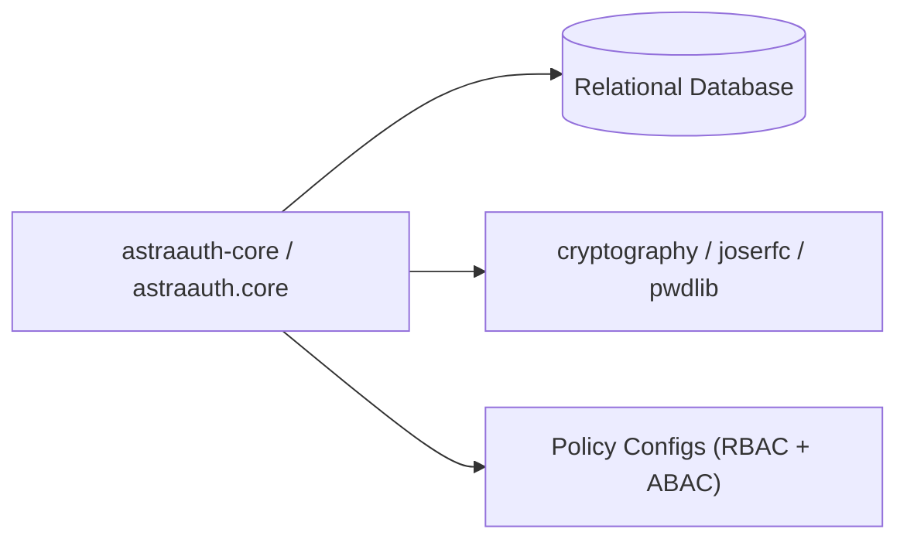

### Module Architecture
*   `config/settings.py`: Resolves settings utilizing `pydantic-settings` (database configurations, token expirations, CORS rules, throttling thresholds).
*   `security/throttling.py`: Controls login and verification rate limits using sliding windows (in-memory or Redis).
*   `persistence/relational.py` & `repositories/`: Centralizes unified SQL connection queries for SQLite, PostgreSQL, and MySQL.
*   `oauth/`: Implements client credentials, PKCE checks, token hashing, API keys (using constant-time timing protection), and Argon2id password hashing.
*   `authorization/`: Evaluation rules matching user metadata and attributes (ABAC) to enforce scopes (`ScopePolicy`).

### Core Workflow: Access Token Verification
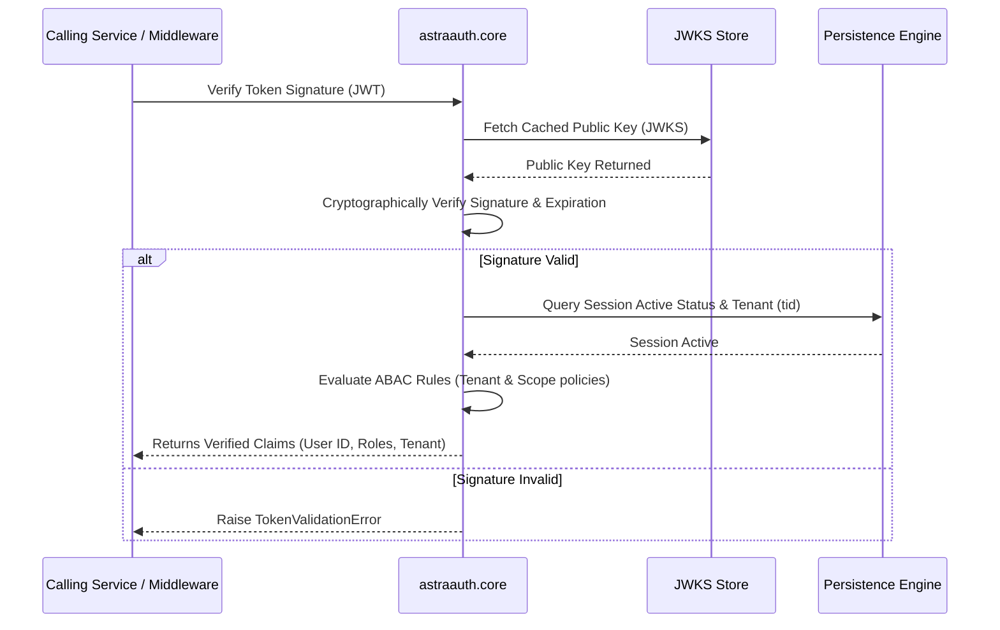

---

## 2. Astra Sutra (Service Module / `astraauth.service`)

The runtime composition layer that bootstraps application setups, connection pools, structured logging, and observability.

### System Context
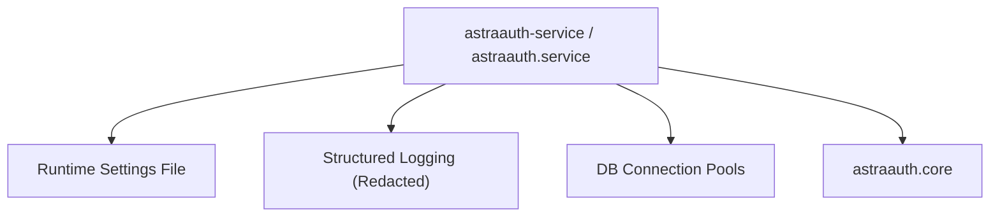

### Module Architecture
*   `factory.py`: The dependency injector. Builds the repository engine, links the correct database pool, configures the event bus, and injects runtime services.
*   `startup.py`: Coordinates database schema updates, manages startup lifecycles, and listens for configuration change triggers.
*   `observability.py`: Manages structured log JSON outputs and telemetry context (correlation ID injection).
*   `redaction.py`: Exposes helper filters that intercept logs to redact passwords, hashes, keys, and challenge pins.

### Core Workflow: Configuration Hot-Reload
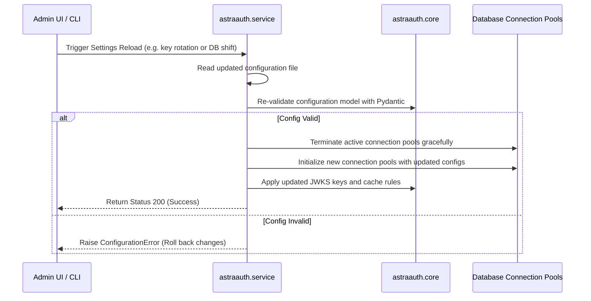

---

## 3. Astra Setu (Adapters Module / `astraauth.adapters`)

Framework wrappers providing pre-built route handlers, session managers, and middleware hooks for major Python runtimes.

### System Context
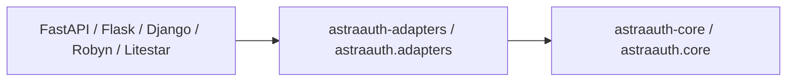

### Module Architecture
*   `base.py`: Defines the parent `AstraBaseMiddleware` protocol.
*   `http_types.py`: Translates framework-specific request variables into unified `HttpRequest` and `HttpResponse` dataclasses.
*   `extensions.py`: Route builder helpers to auto-inject login, logout, and token endpoints into target application routers.
*   `fastapi/`, `flask/`, `django/`, `litestar/`, `robyn/`, `asgi/`: Specific controller submodules mapping framework endpoints to AstraAuth core hooks.

### Core Workflow: FastAPI Dependency Authentication Check
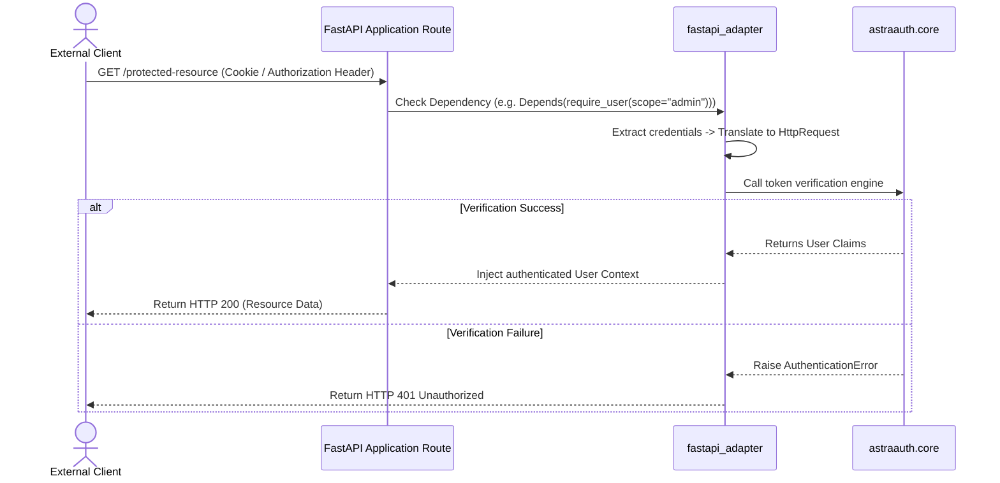

---

## 4. Plugins Engine (`astraauth.plugins`)

The execution coordinator that loads, registers, and sandboxes tenant-specific custom hooks (middleware) with timeout bounds.

### System Context
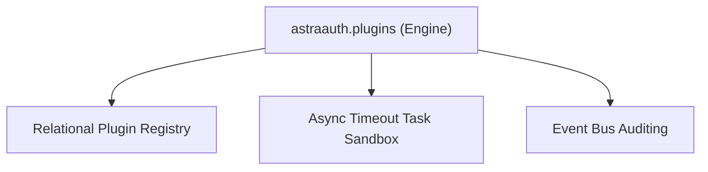

### Module Architecture
*   `contracts.py`: Exposes base execution schemas and parameters that custom tenant plugins must conform to.
*   `runtime.py`: Implements the plugin loading pipeline, handles error boundaries, and runs scripts under strict async timeout conditions.

### Core Workflow: Sandboxed Pre-Authentication Plugin Exec
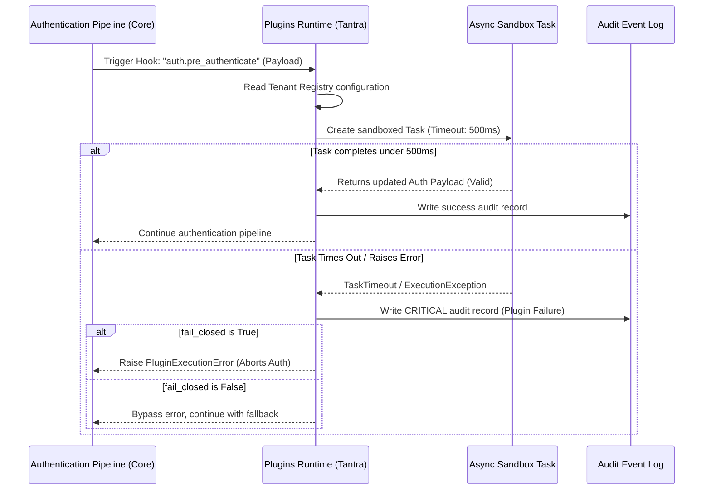

---

## 5. Astra Pramaan (Identity Provider / `astraauth.idp`)

Coordinates identity linking, user mapping, and token validation for federated identity setups (OIDC).

### System Context
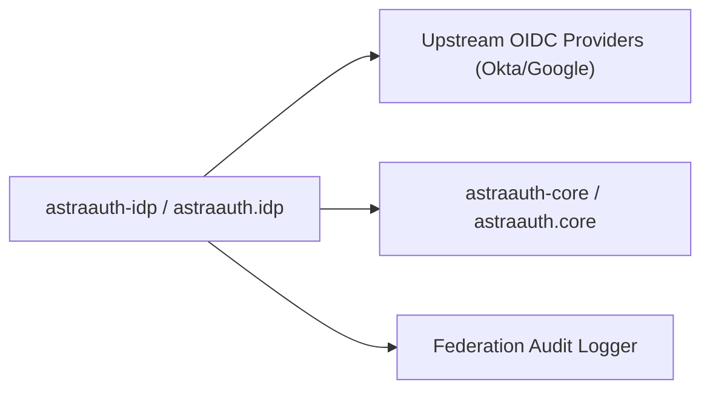

### Module Architecture
*   `store.py`: Exposes interfaces to persist linked identity configurations and callback states.
*   `sql_store.py`: Concrete SQLAlchemy mapping logic for identity linking, state caching, and OIDC logs.
*   `models.py`: Defines schemas for external credentials, role mapping rules, and identity providers.
*   `services.py`: Dispatches JWKS verification, maps claims, links user accounts, and builds OIDC configuration discovery templates.

### Core Workflow: External OIDC Authentication & Account Mapping
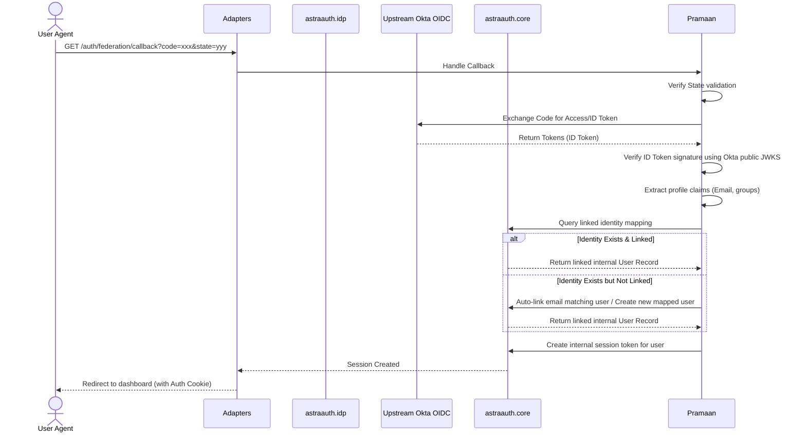

---

## 6. Astra Mudra (WebAuthn Module / `astraauth.webauthn`)

Houses FIDO2 ceremony controllers, handles registration/authentication challenges, and verifies cryptographic public keys.

### System Context
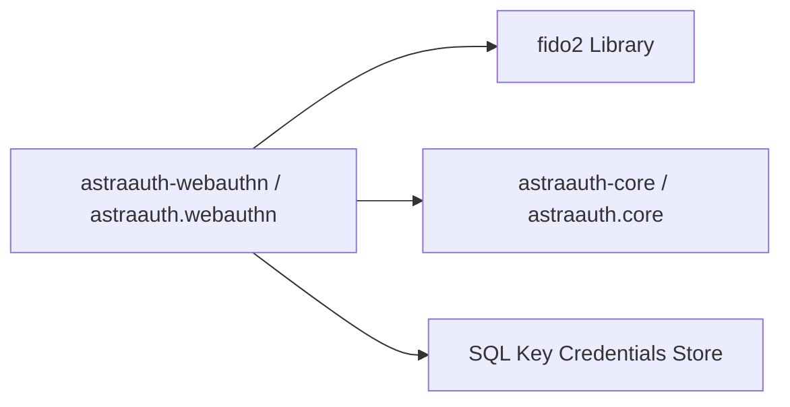

### Module Architecture
*   `store.py` & `sql_store.py`: Declares structures and handles relational databases mapping for registered WebAuthn credentials (public keys, signatures, usage counters).
*   `models.py`: Schemas for FIDO2 ceremony states, challenge requests, and registration responses.
*   `services.py`: Implements key registration verification and assertion ceremony validations.

### Core Workflow: WebAuthn Assertion/Login Ceremony
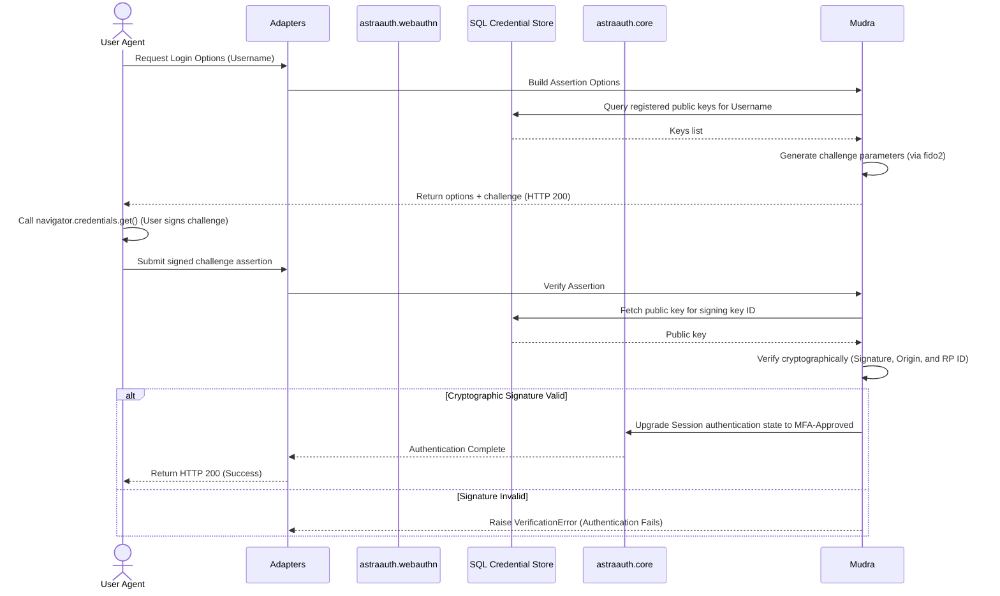

---

## 7. Astra Tantra (Plugins Hub / `astraauth-plugins`)

The separate workspace package housing standard builtin plugins and serving as the hub/registry for community extensions.

### System Context
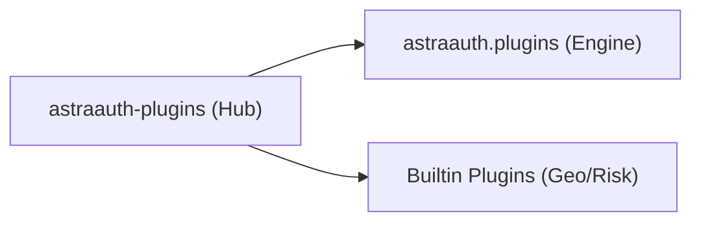

### Module Architecture
*   `builtin_plugins.py`: Houses the standard `GeoSignalPlugin` and `RiskSignalPlugin` parameters.
*   `__init__.py`: Serves as the plugin hub registration gateway, exposing built-in plugins and re-exporting key execution contracts from `astraauth.plugins` for backward compatibility.
*   `examples.py`: Minimal references representing how third-party plugins configure hooks.

---

## 8. Astra Dwaar (Operator CLI / `astraauth-cli`)

The operator interface providing text prompt wizards, textual TUIs, database setup checks, and key backup controllers.

### System Context
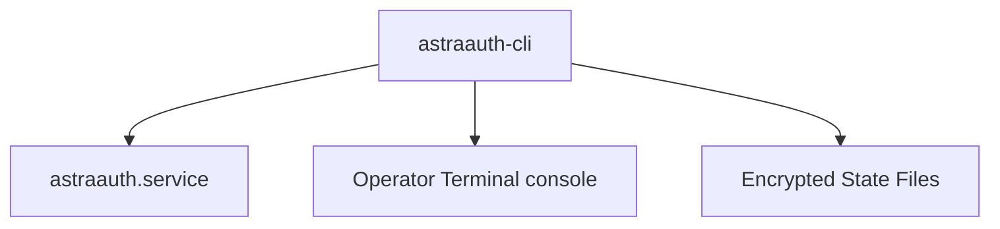

---

## 9. Astra Netra (Admin UI Console / `astraauth-admin-ui`)

A FastAPI-powered web-dashboard utilizing HTMX to allow real-time configurations, audits, and key updates without client JavaScript bundles.

### System Context
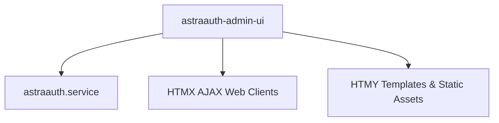

---

## 10. Astra Niyam (ReBAC Policy Engine / `astraauth-policy`)

A Zanzibar-inspired relationship-based access control engine providing schema parsing and check evaluation.

### System Context
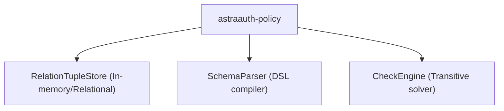

### Module Architecture
*   `parser.py`: Schema compiler parsing KeyNetra-style entity relationship DSL declarations.
*   `engine.py`: Transitive check query solver executing graph traversal algorithm calls.
*   `store.py`: Models and query interfaces for relation fact assertions.

---

## 11. Astra Mandal (Multi-Tenancy / `astraauth-tenancy`)

Provides request context tenant context bindings and ASGI/Flask routing middleware.

### System Context
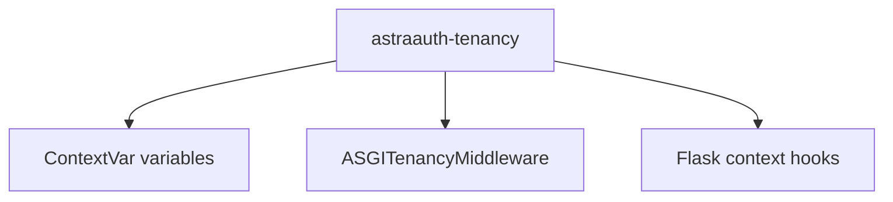

### Module Architecture
*   `models.py`: Tracks workspace boundaries and database connection strings.
*   `middleware.py`: Integrates `ASGITenancyMiddleware` and Flask hooks to dynamically intercept and set context variables.

```
